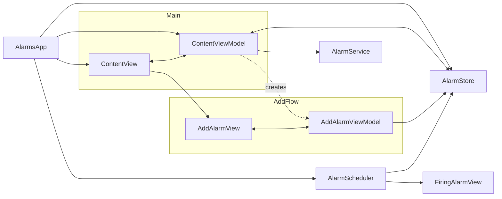

# Alarms App — Hatch Take-Home

A small SwiftUI alarm app built for the Hatch take-home.

## Setup

**Requirements:** Xcode 16+, [xcodegen](https://github.com/yonaskolb/XcodeGen) (`brew install xcodegen`)

```bash
xcodegen generate
open AlarmsApp.xcodeproj
```

Run on any iOS 17+ simulator or device.

## Testing

```bash
xcodebuild test -project AlarmsApp.xcodeproj -scheme AlarmsApp -destination 'platform=iOS Simulator,name=iPhone 17'
```

## Architecture

| File | Role |
|------|------|
| `Models/Alarm.swift` | `Alarm` model + Codable decoding for backend mapping |
| `Stores/AlarmStore.swift` | `@Observable` in-memory store; sorts alarms by time-of-day |
| `Services/AlarmService.swift` | Async fetch from mockapi endpoint |
| `Services/AlarmScheduler.swift` | Minute-aligned timer scheduling; audio playback / fallback tone generation |
| `ViewModels/` | Screen state and intent handling for the main list and add-alarm flow |
| `Views/` | SwiftUI views — list, row, add sheet, firing overlay |

For this take-home, I kept screen coordination pretty lightweight: `ContentViewModel` owns screen state and can create the add-alarm view model from the shared store. If this grew into a larger feature, I’d move that kind of child-screen composition into a dedicated coordinator/router.

Alarm firing presentation follows the same idea: right now a reusable view modifier is applied to screens that may be visible when an alarm triggers. In a larger app, I’d centralize that at the app shell/coordinator layer so new flows wouldn’t have to remember to opt in.

I made a similar tradeoff with `AlarmService`: it stays as a small static fetch client for now, and `ContentViewModel` takes an injectable fetch closure for testability. If the app grew, I’d likely promote that into an injected service protocol.

`AddAlarmView` also uses `@State(initialValue:)` to hold its view model. I think that pattern is reasonable here because the initializer stays lightweight and only assigns simple values; if the view model were doing heavier work at init time, I’d avoid that shape.



## Functional walkthrough

- **List:** Alarms sorted ascending by time-of-day (matching the stock Clock app). Backend-fetched alarms show a cloud badge (☁). Each row has an enable toggle.
- **Add:** Tap **+** → wheel time picker + inline sound picker → **Save** adds locally (no cloud badge).
- **Firing:** `AlarmScheduler` aligns to the next minute boundary, then checks alarms once per minute. When matched it plays the alarm sound and presents `FiringAlarmView` (non-dismissible) with a **Stop** button.
- **Sounds:** Uses bundled audio files when available (for example `ocean.mp3`). If a matching asset cannot be found, it falls back to a generated tone or the system beep.

## Known limitations

- **Foreground-only alarm triggering:** I followed the assignment’s assumption that the app is open and running in the foreground when an alarm fires, so this does not try to handle background-safe scheduling or notification-based delivery.
- **No persistence:** Locally added alarms live in memory only. That matches the prompt’s guidance to avoid persisting alarms across launches / force quits.
- **Simple recurrence model:** Recurring alarms are included as an extra, and weekly/yearly behavior is anchored to the date component already stored on the selected alarm time. The current add flow does not make that anchor especially visible.
- **Past-time one-time alarms:** If a one-time alarm is created for a time earlier than the current time on the same day, it will not roll forward automatically to the next valid firing time.

## What I'd add with more time

1. **Tighten scheduling edge cases** — roll past-time one-time alarms forward, or block invalid selections at creation time.
2. **Clarify recurrence setup** — keep weekly/yearly anchored to the selected date, but expose that anchor more explicitly (for example with an optional date input when recurrence is enabled).
3. **Snooze and delete** — add a Snooze action on the firing screen and swipe-to-delete in the list.
4. **Broader runtime coverage** — add tests around `AlarmScheduler` firing/dismissal flow, queued alarms, and a bit more end-to-end presentation behavior on top of the current unit coverage.
5. **Polish failure states** — refine fetch error presentation beyond the current alert/loading state, and make fallback audio behavior more obvious in the UI.
6. **Centralize alarm presentation if flows grow** — move the firing-alarm presentation out of per-screen modifiers and into a top-level app shell or coordinator once there are more presented screens.
